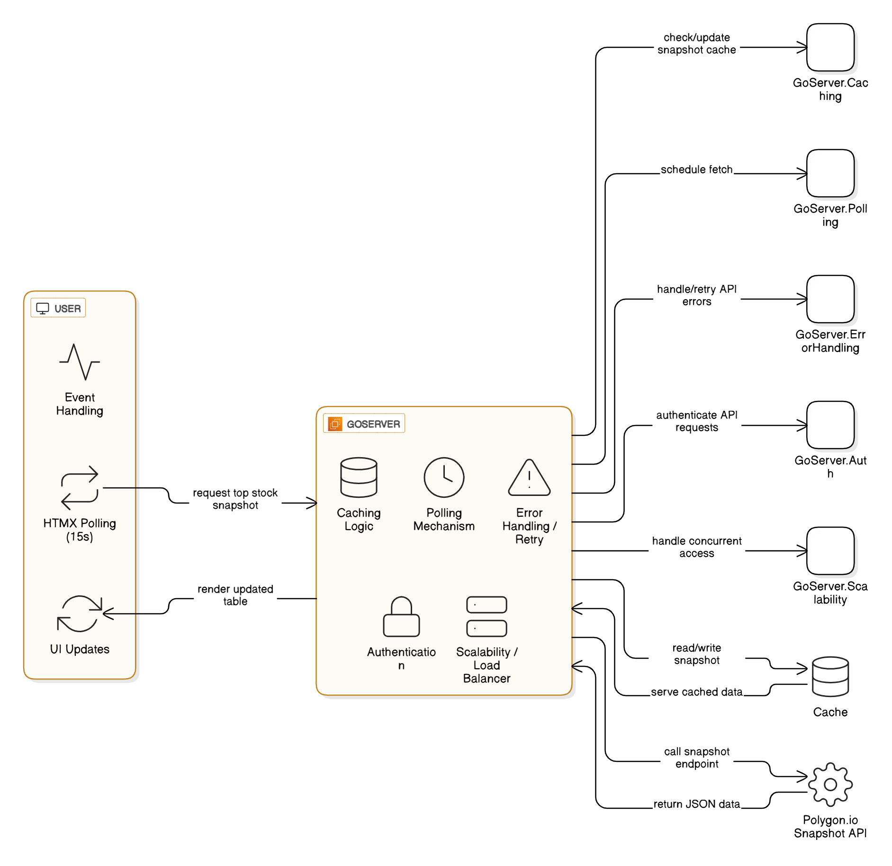

# 📈 StockSpotlight

> A blazing-fast, real-time stock market dashboard built with Go, HTMX, and professional-grade architecture. Features live data feeds, auto log rotation, health monitoring, and a beautiful Azure-themed UI.

---

## 🚀 Quick Start

```bash
# Clone the repository
git clone https://github.com/username/stockspotlight
cd stockspotlight

# Set up configuration
cp internal/config/app.yaml.example internal/config/app.yaml
# Edit app.yaml and add your Finnhub API key

# Run the application
go run cmd/main.go

# Open your browser
open http://localhost:8080
```

---

## 🧩 Architecture Overview

### 💡 Purpose

This application demonstrates a production-ready architecture for real-time financial data visualization, showcasing:
- **Go-based microservices architecture**
- **HTMX-powered reactive frontend** (zero JavaScript frameworks)
- **Multi-tiered caching strategy**
- **Professional logging with automatic rotation**
- **Health monitoring and observability**
- **Graceful error handling and retry logic**

---



## 🛠️ Core Features

### 📊 Real-Time Data Dashboard
| Component | Description | Refresh Rate |
|-----------|-------------|--------------|
| **Most Active Stocks** | Live trading volume leaders | 15s |
| **Top Gainers** | Highest percentage gainers | 20s |
| **Top Losers** | Biggest percentage declines | 20s |
| **Company Profiles** | Detailed company information | 30s |
| **Market News** | Latest financial headlines | 60s |

### 🔧 System Features
| Feature | Description |
|---------|-------------|
| ✅ **Smart Caching** | In-memory cache prevents API spam & boosts performance |
| ✅ **Auto Log Rotation** | Logs rotate at 10MB or 5 days, auto-cleanup old files |
| ✅ **Health Monitoring** | `/healthz` endpoint + log management APIs |
| ✅ **Retry Logic** | Automatic retry on API failures with exponential backoff |
| ✅ **Graceful Shutdown** | Clean resource cleanup on SIGTERM/SIGINT |
| ✅ **Professional UI** | Azure blue theme with responsive Bootstrap design |

---

## 🌐 API Integration

- **Primary Source**: [Finnhub Stock API](https://finnhub.io/)
- **Endpoints Used**: Most Active, Gainers/Losers, Company Profiles
- **Security**: API keys stored in config files (never hardcoded)
- **Rate Limiting**: Built-in request throttling and caching

---

## 🎨 Technology Stack

### Backend
| Technology | Purpose |
|-----------|---------|
| **Go 1.21+** | High-performance backend service |
| **HTMX 1.9.5** | Reactive frontend without JavaScript |
| **Bootstrap 5.3** | Professional responsive UI framework |

### Architecture Patterns
| Pattern | Implementation |
|---------|---------------|
| **Clean Architecture** | Modular internal packages |
| **Repository Pattern** | API abstraction layer |
| **Observer Pattern** | HTMX polling for real-time updates |
| **Singleton Pattern** | Cache and logger instances |

---

## 🚦 Monitoring & Observability

### Health Check Endpoints
```bash
# System health
GET /healthz

# Log statistics  
GET /logs/status

# Force log rotation
POST /logs/rotate

# Cleanup old logs
POST /logs/cleanup
```

### Log Management
- **Location**: `logs/app.log`
- **Rotation**: Automatic (10MB or 5 days)
- **Retention**: 10 rotated files maximum
- **Format**: Structured JSON with timestamps

---

## 🏗️ Project Structure

```
stockspotlight/
├── cmd/
│   └── main.go                    # Application entry point
├── internal/
│   ├── api/                       # External API clients
│   │   ├── client.go             # HTTP client configuration  
│   │   └── finnhub.go            # Finnhub API integration
│   ├── cache/                     # Caching layer
│   │   └── cache.go              # In-memory cache with TTL
│   ├── config/                    # Configuration management
│   │   ├── config.go             # Config loading logic
│   │   └── app.yaml              # API keys & settings
│   ├── health/                    # Health check handlers
│   │   └── health.go             # System health endpoints
│   └── logger/                    # Logging system
│       ├── logger.go             # Enhanced logger with rotation
│       └── rotation.go           # Log rotation & cleanup logic
├── static/                        # Frontend assets
│   ├── index.html                # Main dashboard (HTMX + Bootstrap)
│   ├── stock_table.html          # Most active stocks template
│   ├── gainers_table.html        # Top gainers template  
│   ├── losers_table.html         # Top losers template
│   ├── company_profile.html      # Company info template
│   ├── news_feed.html            # News articles template
│   └── styles.css                # Azure blue theme styling
├── logs/                          # Application logs (auto-created)
├── docs/                          # Documentation assets
├── .gitignore
├── README.md
├── go.mod
└── go.sum
```

---

## ⚙️ Configuration

### 1. Set Up API Access
```bash
# Copy the example config
cp internal/config/app.yaml.example internal/config/app.yaml

# Edit with your API credentials
nano internal/config/app.yaml
```

### 2. Example Configuration
```yaml
api_key: "your-finnhub-api-key-here"
ticker_limit: 10
cache_ttl: 300
server:
  port: 8080
  timeout: 30
logging:
  level: "info"
  max_size_mb: 10
  max_age_days: 5
```

### 3. Environment Variables (Optional)
```bash
export PORT=8080
export FINNHUB_API_KEY=your-key-here
```

---

## 🚀 Deployment

### Local Development
```bash
# Install dependencies
go mod tidy

# Run in development mode
go run cmd/main.go

# Build for production
go build -o stockspotlight cmd/main.go
./stockspotlight
```

### Docker Deployment
```bash
# Build image
docker build -t stockspotlight .

# Run container
docker run -p 8080:8080 \
  -e FINNHUB_API_KEY=your-key \
  stockspotlight
```

### Production Considerations
- Use a reverse proxy (nginx/Caddy)
- Set up log aggregation (ELK stack)
- Configure monitoring (Prometheus/Grafana)
- Use environment variables for secrets
- Enable TLS/HTTPS

---

## 🔧 API Reference

### Stock Data Endpoints
```bash
# Most active stocks
GET /data/most-active

# Top gainers
GET /data/gainers  

# Top losers
GET /data/losers

# Company profile
GET /data/profile?symbol=AAPL

# Market news
GET /data/news?category=general
```

### System Management
```bash
# Health check
curl http://localhost:8080/healthz

# Log status
curl http://localhost:8080/logs/status

# Force log rotation
curl -X POST http://localhost:8080/logs/rotate
```

---

## 🎯 Performance Features

- **Sub-second response times** with intelligent caching
- **Zero JavaScript** - pure HTMX for 90% smaller bundle size  
- **Memory-efficient** - Go's garbage collector + smart caching
- **Auto-scaling logs** - prevents disk space issues
- **Graceful degradation** - works even when APIs are down

---

## 🤝 Contributing

1. Fork the repository
2. Create a feature branch (`git checkout -b feature/amazing-feature`)
3. Commit your changes (`git commit -m 'Add amazing feature'`)
4. Push to the branch (`git push origin feature/amazing-feature`)
5. Open a Pull Request

---

## 📝 License

This project is licensed under the MIT License - see the [LICENSE](LICENSE) file for details.

---

## 🙏 Acknowledgments

- [Finnhub.io](https://finnhub.io/) for reliable stock market data
- [HTMX](https://htmx.org/) for making frontend development fun again
- [Bootstrap](https://getbootstrap.com/) for beautiful, responsive components